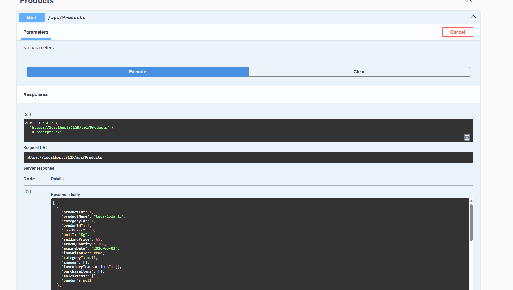
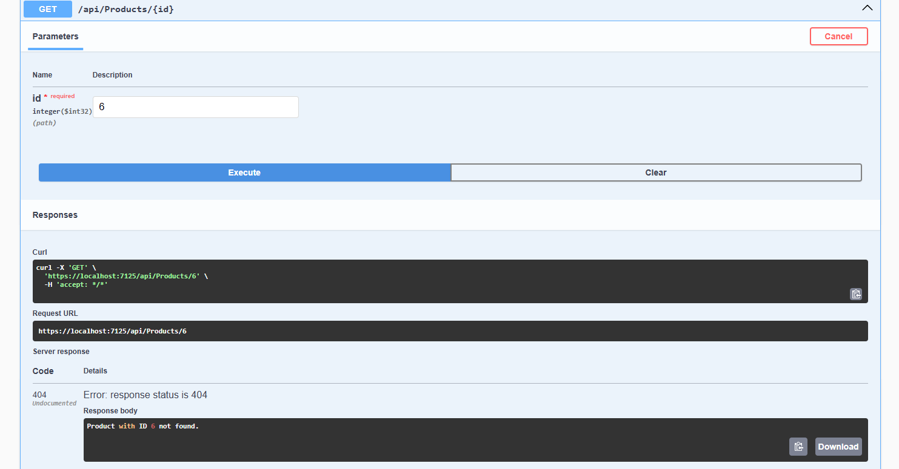
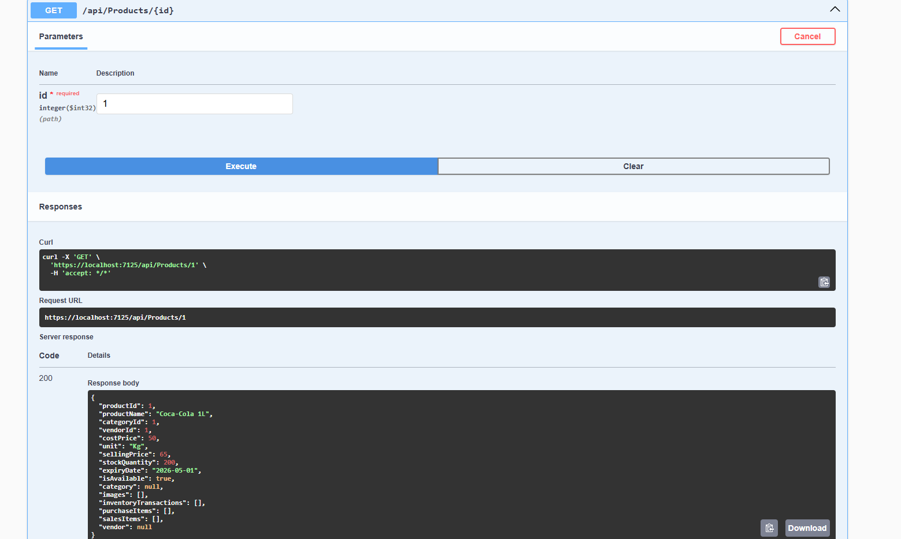
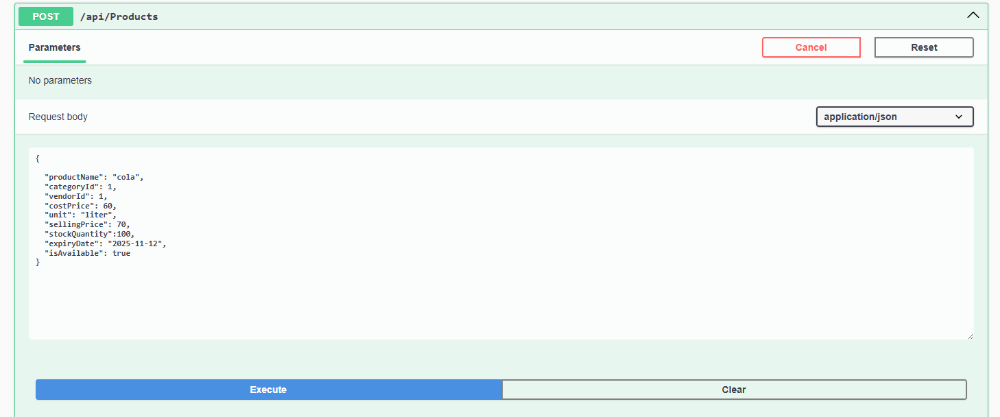
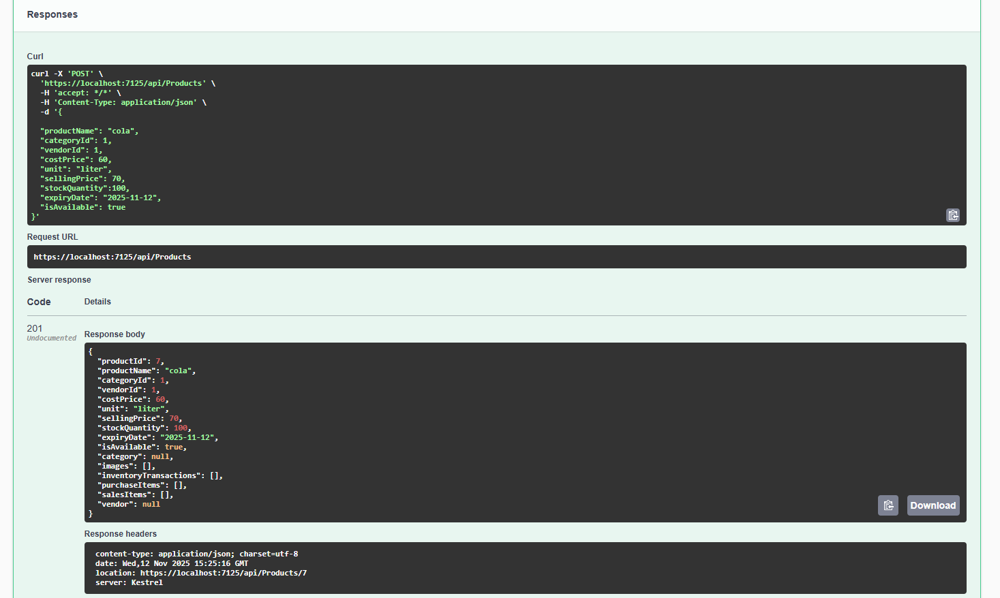
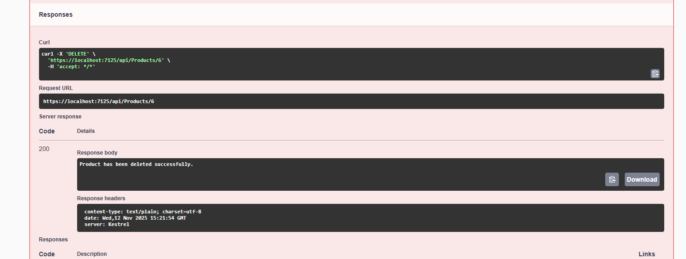

"# GroceryApp" 


```
Currently Working On This Project 
```

```
--- 📘 Database Overview ---
```
```
This project contains a SQL Server database design for a  Grocery Management System, built to manage users, customers, vendors, products, purchases, sales, inventory, and more.
It ensures data consistency, referential integrity, and supports future integration with ASP.NET Core, Angular, or any other backend framework.

🧱 Database Name
GroceryDB;

📂 Tables Included
Table Name	Description
Users	Stores login credentials and role-based access info for system users.
Customers	Contains customer details like name, phone, address, and registration date.
Vendors	Manages supplier or vendor information including contact and address.
Categories	Defines product categories for organized inventory management.
Products	Holds product details including category, vendor, price, stock, and availability.
Purchases	Records purchase orders made from vendors by system users.
PurchaseItems	Tracks each item under a purchase order.
Sales	Stores customer sales transactions with payment details.
SalesItem	Lists each product sold under a sales invoice.
InventoryTransaction	Logs stock changes from purchases and sales to maintain real-time inventory.
LoginAudit	Tracks user login activities with timestamps and IP addresses.
Images	Manages product, vendor, and customer image references.
Employees	Stores employee information linked to users and HR details.

⚙️ Key Features

✅ Relational Database Design with proper foreign key constraints.

🔐 User Management (Admins, employees, etc.)

🛍️ Customer & Vendor Tracking

📦 Product Categorization and Inventory Control

💰 Sales & Purchase Management

📸 Image Handling for Products, Vendors, Customers, and Users

🧾 Audit Logs for Login Activities

👨‍💼 Employee Records with Role and Salary Management


🧩 Relationships

Each Product belongs to one Category and one Vendor.

Each Purchase is linked to a Vendor and a User (who made the purchase).

Each Sale is linked to a Customer and a User (who processed it).

InventoryTransaction updates automatically based on Purchases or Sales.

Images table is designed for flexible use — can store images for multiple entities.

🗂️ ERD (Entity Relationship Diagram)

Users ──< Purchases >── Vendors  
Users ──< Sales >── Customers  
Products ──< PurchaseItems >── Purchases  
Products ──< SalesItem >── Sales  

🧰 Technologies Used

Microsoft SQL Server

T-SQL (Transact-SQL)

SSMS (SQL Server Management Studio)

🧾 Sample Command
-- Example: Insert a new product
INSERT INTO Products (productName, categoryId, vendorId, costPrice, sellingPrice, stockQuantity)
VALUES ('Rice 1kg', 1, 2, 45.00, 60.00, 100);

🚀 How to Use

Open SQL Server Management Studio (SSMS).

Create a new database:

CREATE DATABASE GroceryDB;
USE GroceryDB;


Copy and run the SQL script from this repository.

Verify all tables using:

SELECT * FROM sys.tables;


Start inserting sample data to test relationships.
```


```
--------BackEnd Overview--------
```







Api Ongoing


